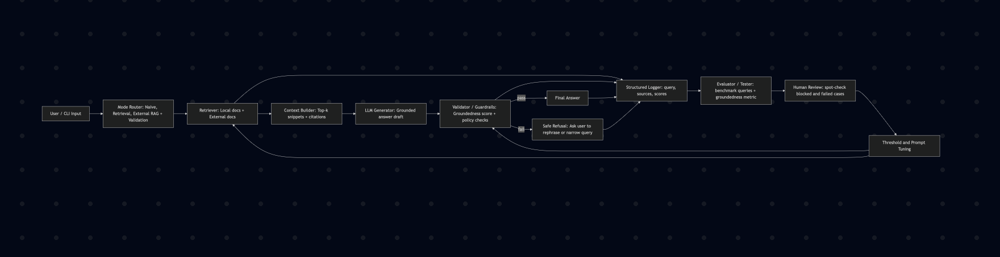

# DocuBot: Retrieval-Grounded Documentation Assistant

## Original Project and What It Did
The original project is **DocuBot Tinker Activity**. Its initial goal was to help students compare three AI behaviors side-by-side: naive generation, retrieval-only lookup, and retrieval-augmented generation (RAG). In its original form, DocuBot indexed local markdown docs, retrieved the most relevant snippets with a simple lexical scorer, and optionally used Gemini to generate answers grounded in those snippets.

## Title and Summary
**DocuBot** is a lightweight AI assistant for developer documentation that prioritizes grounded answers over fluent guesses. It matters because it demonstrates a practical reliability pattern for AI products: retrieve evidence first, generate second, and refuse when confidence is low.

This repository is designed as a portfolio-friendly applied AI system that includes:
- Retrieval-Augmented Generation (RAG)
- Explicit refusal guardrails when evidence is weak
- A repeatable evaluation script to measure retrieval quality

## Extension Scope (Kept Simple)
This extension intentionally focuses on the original goal without adding unnecessary complexity:
- Retrieve from local docs plus optional external documentation URLs
- Validate generated answers for groundedness
- Block low-confidence answers with a safe refusal
- Evaluate groundedness and block reasons from one command

No agent framework, no extra service layer, and no database changes were added.

## Architecture Overview
The system routes each user question through one of three modes. In the strongest mode (RAG), DocuBot retrieves evidence snippets from docs, then asks the LLM to answer using only those snippets.



### Data flow in plain language
1. **Input**: A user asks a documentation question in CLI.
2. **Process**: DocuBot tokenizes the query, retrieves relevant doc sections, and optionally generates an answer from retrieved snippets.
3. **Guardrail**: If meaningful evidence is missing, DocuBot refuses instead of hallucinating.
4. **Output**: Either a grounded answer or a safe refusal.
5. **Human/testing loop**: `evaluation.py` reports hit rate so developers can tune retrieval behavior.

## Setup Instructions
### 1. Clone and enter the project
```bash
git clone <your-repo-url>
cd applied-ai-system
```

### 2. Create and activate a virtual environment
```bash
python3 -m venv .venv
source .venv/bin/activate
```

### 3. Install dependencies
```bash
pip install -r requirements.txt
```

### 4. Configure environment variables
```bash
cp .env.example .env
```

Edit `.env` and add:
```bash
GEMINI_API_KEY=your_api_key_here

# Optional (for External RAG mode)
EXTERNAL_DOC_URLS=https://example.com/docs,https://example.com/api

# Optional validation tuning
VALIDATION_MIN_SCORE=0.65

# Optional run log file for mode 4
DOCUBOT_LOG_PATH=logs/external_rag_runs.jsonl
```

Notes:
- Without `GEMINI_API_KEY`, mode 1 (naive LLM) and mode 3 (RAG) are disabled.
- Mode 2 (retrieval-only) still works.
- Mode 4 (External RAG + validation) requires `GEMINI_API_KEY` and at least one `EXTERNAL_DOC_URLS` value.

### 5. Run the app
```bash
python main.py
```

### 6. Run evaluation
```bash
python evaluation.py

# Groundedness + block-reason evaluation for validated External RAG
python evaluation.py --validated-external-rag
```

## Quick Run (Extension Demo)
1. Set `GEMINI_API_KEY` and at least one `EXTERNAL_DOC_URLS` in `.env`.
2. Run `python main.py` and choose mode `4`.
3. Ask one or more queries and observe:
    - Final answer or hard refusal
    - Validation score/method
    - Structured logs in `logs/external_rag_runs.jsonl` (or your custom path)
4. Run `python evaluation.py --validated-external-rag` to get pass rate and block reason summary.

## Sample Interactions
Below are representative examples from the current implementation.

### Example 1: Retrieval-only mode (Mode 2)
**Input**
```text
Where is the auth token generated?
```

**Output (excerpt)**
```text
[AUTH.md]
Tokens are created by the generate_access_token function in the auth_utils.py module.
```

### Example 2: RAG mode (Mode 3)
**Input**
```text
What does the /api/projects/<project_id> route return?
```

**Output**
```text
[API_REFERENCE.md]
### GET /api/projects/<project_id>

---
[API_REFERENCE.md]
This document lists the main API endpoints available in the sample application.
```

*Note: RAG mode returns the retrieved snippets grounded in documentation. These are the evidence chunks used to answer the question.*

### Example 3: Guardrail refusal
**Input**
```text
How does payment processing work in this system?
```

**Output**
```text
I do not know based on these docs.
```

## Design Decisions and Trade-offs
### Why this design
- **Three modes** make AI behavior differences visible and teachable.
- **Simple lexical retrieval** keeps the system transparent and debuggable.
- **Evidence-based refusal** improves reliability by blocking unsupported claims.

### Trade-offs
- Lexical retrieval is fast and easy to inspect, but weaker than semantic retrieval on paraphrases.
- A strict refusal policy reduces hallucinations, but may refuse some partially answerable questions.
- CLI-first design is reproducible and simple, but less user-friendly than a web UI.

## Testing Summary
### End-to-end verification run (3 inputs)

Case 1: Retrieval-only behavior
- Input: `What environment variables are required for authentication?`
- Mode: Retrieval only
- Output:
```text
[AUTH.md]
This document explains how authentication works in the sample application. It covers token generation, required environment variables, and the expected client workflow.

---
[AUTH.md]
## Environment Variables

---
[AUTH.md]
The authentication system depends on two variables:

- AUTH_SECRET_KEY
  A secret string used to sign all access tokens. Must be long and unpredictable.

- TOKEN_LIFETIME_SECONDS
  Controls how long a generated token remains valid. Defaults to 3600 seconds if not set.
```

Case 2: AI feature behavior (RAG)
- Input: `What does the /api/projects/<project_id> route return?`
- Mode: RAG
- Output:
```text
[API_REFERENCE.md]
### GET /api/projects/<project_id>

---
[API_REFERENCE.md]
This document lists the main API endpoints available in the sample application. It describes each route's purpose, required parameters, and expected responses.

---
[API_REFERENCE.md]
### GET /api/projects
```

*RAG mode retrieves and displays the relevant documentation snippets as the answer source.*

Case 3: Reliability / guardrail behavior
- Input: `How does payment processing work in this system?`
- Mode: Validated External RAG + Guardrail
- Output: 
```text
I cannot confidently validate this answer against the retrieved docs. Please rephrase your question or ask for a narrower topic.
Validation: score=0.00, method=heuristic, blocked=True
```

This demonstrates: end-to-end execution, AI mode behavior, and explicit guardrail refusal with confidence metadata.

## Demo Video
A complete walkthrough of extended DocuBot in action:
- [Demo.gif](assets/Demo.gif) 
— End-to-end demo showing all three modes and guardrail behavior

### What worked
- Retrieval evaluation runs end-to-end and reports measurable quality.
- Current measured retrieval hit rate: **0.88** on `SAMPLE_QUERIES`.
- RAG mode can produce grounded answers when relevant snippets are found.
- Validated External RAG evaluation runs end-to-end and reports groundedness plus block reasons.

### What did not work perfectly
- Queries with terms absent from docs can still retrieve weak lexical matches.
- Naive LLM mode in current code does not fully leverage full-corpus grounding.
- Retrieval can miss intent when wording differs from document phrasing.

### What I learned
- Reliability comes from system design, not just model choice.
- Guardrails and evaluation are essential to make AI outputs trustworthy.
- Even simple retrieval pipelines become much stronger with iterative testing.

## Reflection
This project taught me to treat AI as a system engineering problem, not a prompt-only problem. The biggest lesson was that useful AI requires an explicit loop: retrieve evidence, generate carefully, validate behavior, and measure results continuously.

I also learned how to make trade-offs between speed, transparency, and answer quality. For employer-facing work, I now prioritize observability and failure handling (refusals, tests, and clear setup) because they make AI features maintainable in real production environments.

## Repository Structure
```text
.
├── main.py           # CLI entry point and mode selection
├── docubot.py        # Retrieval, indexing, guardrail checks, answer orchestration
├── llm_client.py     # Gemini wrapper and prompting logic
├── evaluation.py     # Retrieval evaluation harness
├── dataset.py        # Sample queries and fallback docs
├── docs/             # Local documentation corpus used for retrieval
└── requirements.txt  # Python dependencies
```

## Future Improvements
- Tune retrieval scoring for better recall on paraphrased queries
- Migrate from deprecated `google.generativeai` to `google.genai`
- Add a small benchmark set for external URL queries
